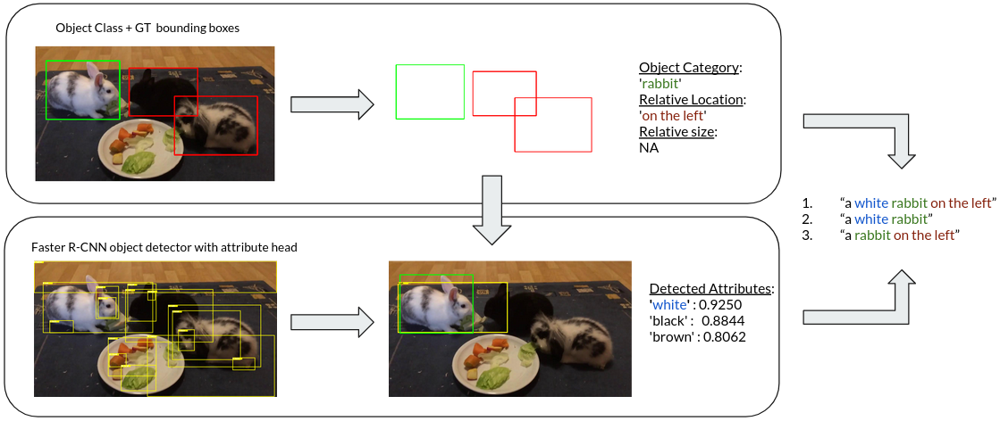

# Sythref
SynthRef: Generation of Synthetic Referring Expressions for Object Segmentation

## Dependencies

## Datasets

### 1. YouTube-VIS

In this work we used SynthRef method to generate synthetic referring expressions
for the YouTube-VIS training dataset [[1]](#1).

YouTube-VIS training dataset can be downloaded [here].

[here]: https://youtube-vos.org/dataset/vis/

## SynthRef

SynthRef's referring expressions include attributes for target objects, which are 
predicted by the model of [Unbiased Scene Graph Generation from Biased Training], a
scence graph generation model base on Faster R-CNN. 

As we used this model for predicting attributes for the objects in YouTube-VIS, you
can use this model on any other dataset.

In our paper we only take advantage of the detected attributes but we encourage the community to explore also
the scene graph relationships for the generation of synthetic referring expressions.

## SynthRef-YouTube-VIS Dataset

[Unbiased Scene Graph Generation from Biased Training]: https://github.com/KaihuaTang/Scene-Graph-Benchmark.pytorch
## Experiments

The model used in our experiments is [RefVOS] [[2]](#2) 

We provide the Dataloader python file which can be used in order to train RefVOS 
with SynthRef-YouTube-VIS dataset.

[RefVOS]: https://arxiv.org/abs/2010.00263
## References
<a id="1">[1]</a> 
Video instance segmentation (2019).
Linjie Yang, Yuchen Fan, and Ning Xu.
In Proceedings of the IEEE International Conference on Computer Vision, pages 5188–5197.

<a id="2">[2]</a>
Refvos: A closer look at referring expressions for video object segmentation (2020).
Miriam Bellver, Carles Ventura, Carina Silberer, Ioannis Kazakos, Jordi Torres, and Xavier Giro-i Nieto.
arXiv preprint arXiv:2010.00263